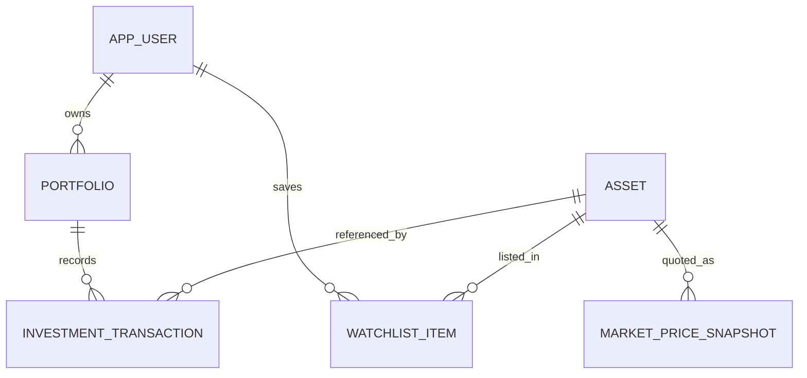

# Gabnex

Gabnex is a portfolio tracker for recording stock and ETF transactions, deriving holdings from those transactions, and viewing performance when valid market quotes are available. It is a tracking tool, not a broker, tax product, or investment adviser.

## Features

- JWT authenticated accounts with BCrypt password hashes.
- Owner-scoped portfolios, transaction records, and watchlists.
- Weighted average cost holdings with fees, realized P/L, and unrealized P/L.
- Alpha Vantage symbol search and end-of-day quote integration.
- Quote cache and timestamp/source labels; missing quotes remain unavailable.
- Responsive dashboard, portfolio manager, holdings, searchable assets, watchlist, transaction history with filtering/sorting/pagination, and settings screens.
- PostgreSQL schema managed by Flyway, Docker Compose, and GitHub Actions CI.

Screenshots: capture the dashboard and asset search after running the app locally; this repository does not include fabricated screenshots.

## Stack and layout

- Java 21, Spring Boot 3.3.5, Spring Web, Spring Security, JDBC, PostgreSQL, Flyway, JJWT, Springdoc OpenAPI.
- React 18, Vite, React Router, Recharts, plain CSS.
- PostgreSQL 16, Docker Compose, GitHub Actions.

```text
backend/src/main/java/dev/gabnex/     API, JWT security, accounting engine
backend/src/main/java/dev/gabnex/marketdata/ provider abstraction and quote service
backend/src/main/resources/db/migration/ Flyway SQL migrations
backend/src/test/                     accounting, market-data, and API integration tests
frontend/src/                          React application and styles
.github/workflows/ci.yml               backend and frontend CI
docker-compose.yml                     local database and app stack
```

The application is a modular monolith. The HTTP API uses `/api/v1`; persistence uses explicit SQL/JDBC and database constraints. API documentation is served by Springdoc at `/swagger-ui/index.html`, and health is at `/actuator/health`.



## Financial conventions

- Portfolio base currency is restricted to USD, EUR, GBP, CAD, or AUD. The API rejects transactions whose known quote currency differs from the portfolio base currency. FX conversion is not implemented.
- Quantities and amounts use PostgreSQL `NUMERIC` and Java `BigDecimal`. Share precision is 8 decimal places. The weighted-average cost engine retains intermediate precision and uses HALF_EVEN for partial-sale allocation; display average cost is rounded to 8 places.
- Buy fees increase cost basis. Sell fees reduce proceeds. Realized P/L is net sale proceeds minus weighted-average basis removed. A full liquidation removes all remaining basis to avoid rounding residue.
- Unrealized P/L is market value minus open cost basis. Overall P/L is shown only when all open holding prices are present; it combines realized P/L with unrealized P/L.
- Allocation uses available market values and explicitly marks the total incomplete if any held asset has no quote. It does not treat missing prices as zero for a complete total.
- Historical portfolio performance and time-weighted/money-weighted returns are intentionally omitted: the app does not yet build valid historical portfolio valuations.

## Market data

Gabnex uses [Alpha Vantage](https://www.alphavantage.co/documentation/) `SYMBOL_SEARCH` and `GLOBAL_QUOTE` endpoints. Search results are filtered to provider-classified equity/stock and ETF listings. A genuine API key is required and stays on the backend in `MARKET_DATA_API_KEY`.

Alpha Vantage states that its standard free service has 25 API requests per day. Its default global quote is end-of-day; US real-time and 15-minute delayed quote entitlements are premium. The API response does not establish a per-quote real-time classification in this implementation, so quotes are labeled **end of day**. This project does not claim real-time prices. See the provider's [support page](https://www.alphavantage.co/support/) and [market data policies](https://www.alphavantage.co/realtime_data_policy/) for current terms and entitlements.

Successful quotes are persisted with retrieval time, provider, currency, and classification. A quote is reused for 24 hours by default to reduce calls. After expiry, refresh is attempted; on missing key, invalid provider payload, or outage, the API reports unavailable or returns the last snapshot explicitly as stale. No production prices or historical points are fabricated. Provider outages are intentionally surfaced, while transactions remain accessible.

## Local setup

Prerequisites: Java 21, Maven 3.9+, Node.js 20+, npm, and Docker with Compose.

1. Copy `.env.example` to `.env`, replace `JWT_SECRET` with a random secret of at least 32 bytes, and optionally add an Alpha Vantage key.
2. Start PostgreSQL and backend with `docker compose up --build db backend`.
3. In another terminal, run `cd frontend && npm install --no-audit --no-fund && npm run dev`.
4. Open `http://localhost:5173`. Register an account, create a portfolio, find a supported ticker, add it to the watchlist, and record a transaction.

Or run the full local stack with `docker compose up --build`; the UI is served at `http://localhost:5173` and the API at `http://localhost:8080`.

The backend applies Flyway migrations at startup. For standalone development, set the variables from `.env.example`, run `mvn -f backend/pom.xml spring-boot:run`, and run the frontend separately. The API defaults to PostgreSQL; there is no H2 fallback.

| Variable | Purpose |
|---|---|
| `DATABASE_URL` | JDBC PostgreSQL connection URL |
| `DATABASE_USERNAME`, `DATABASE_PASSWORD` | Database credentials |
| `JWT_SECRET` | HMAC signing secret, at least 32 bytes |
| `MARKET_DATA_API_KEY` | Alpha Vantage server-side key; optional for non-market features |
| `MARKET_DATA_BASE_URL` | Provider query URL |
| `MARKET_DATA_CACHE_MINUTES` | Quote cache duration; default 1440 |
| `FRONTEND_ORIGIN` | Allowed browser origin for API CORS |
| `PORT` | Backend listening port |
| `VITE_API_URL` | Browser-visible API base URL (not a secret) |

Never put provider or JWT secrets in `VITE_*` variables or commit `.env`.

## API and authentication

Main endpoints include `POST /api/v1/auth/register`, `POST /api/v1/auth/login`, `GET /api/v1/auth/me`, portfolio CRUD under `/api/v1/portfolios`, transactions under portfolio paths and `/api/v1/transactions/{id}`, holdings, dashboard, allocation, asset search/price, and watchlist CRUD. Transaction history accepts `page`, `size`, `type`, `fromDate`, `toDate`, `sort`, and `direction`; sort keys are allow-listed. JWTs are returned as bearer tokens and expire after 24 hours. The browser stores the token in localStorage, which is simple for a portfolio project but more exposed to script injection than a correctly configured HttpOnly cookie. Logout removes the client token; there is no server-side JWT revocation list. CSRF is disabled because this API uses bearer authorization rather than ambient cookies.

Ownership is resolved from the authenticated principal in database queries. Important uniqueness, foreign-key, and numeric constraints are enforced in PostgreSQL. Errors use JSON responses without stack traces. This is not a security audit; add rate limiting, refresh/revocation, security headers, and an external review before handling sensitive real-world usage.

## Tests and CI

Run `JAVA_HOME=/path/to/jdk-21 ./backend/mvnw -B -f backend/pom.xml verify` and `cd frontend && npm ci && npm test && npm run build`. Backend tests cover weighted-average cost, market-data service behavior, and HTTP API flows against an in-memory H2 database. Tests do not call Alpha Vantage. CI runs backend Maven verification and frontend tests/build on pushes and pull requests; npm installs from the committed lockfile.

## Deployment

Use a host that supports Java 21 containers, PostgreSQL, and static or containerized frontend hosting. The `prod` Spring profile is configured in `backend/src/main/resources/application-prod.yml`; it requires database credentials, `JWT_SECRET`, and `FRONTEND_ORIGIN`, and suppresses error details. Build the backend with `backend/Dockerfile` and frontend with `frontend/Dockerfile`; set backend secrets and database environment variables in the hosting control panel. Set `FRONTEND_ORIGIN` to the deployed UI origin, and build the frontend with `VITE_API_URL` pointing to the deployed `/api/v1` endpoint. Run migrations at backend startup via Flyway and configure a health check against `/actuator/health`. Use managed PostgreSQL backups and TLS. No deployment has been performed from this workspace.

## Limitations and next steps

- Alpha Vantage free access and data entitlements are subject to provider terms, coverage, and request limits. No key is included.
- No FX conversion, brokerage sync, tax-lot reporting, short selling, portfolio return series, or historical price reconstruction. Portfolio edit/delete screens and transaction edit/delete controls are not yet exposed in the UI, although corresponding API operations are implemented.
- Market quote failures are explicit; only the selected holding table/dashboard quote path is wired for saved assets. Watchlist quotes are not bulk refreshed.
- Bearer-token localStorage, no JWT revocation, and limited request throttling are known security trade-offs.
- Validate migrations and application startup against PostgreSQL, and exercise provider HTTP parsing with a controlled HTTP server before public deployment. Existing API integration tests use H2 and cover authorization isolation and core transaction flows.

## License

MIT; see [LICENSE](LICENSE).
